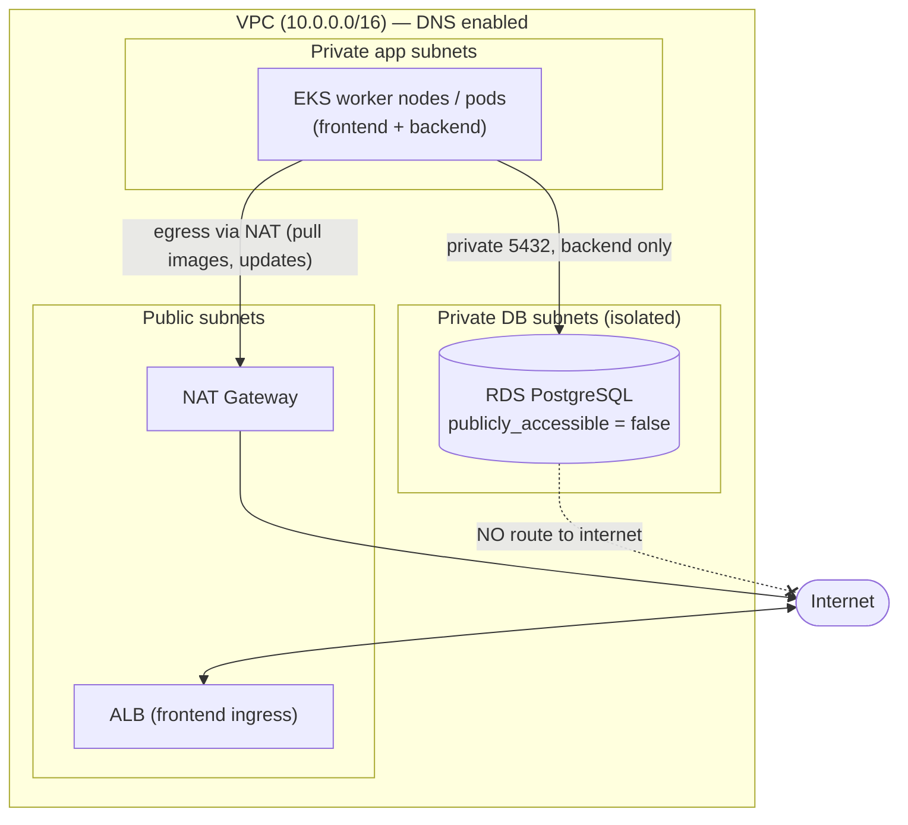

# Private Database Connectivity (EKS → RDS PostgreSQL)

**Goal:** the backend connects to a PostgreSQL database over the **private
network only**. The database is **never reachable from the public internet** — no
public IP, no internet route, and a firewall that admits only the application.

This maps to the running app: the backend reads its connection details from
environment variables ([`backend/src/db.js`](../backend/src/db.js)), supplied by a
ConfigMap (non-secret) and a Secret (the password) — see
[`k8s/backend-configmap.yaml`](../k8s/backend-configmap.yaml) and
[`k8s/backend-secret-example.yaml`](../k8s/backend-secret-example.yaml). Nothing
about the database lives in code.

---

## 1. The network picture

Everything lives in **one VPC**, split into three tiers of subnets across at least
two Availability Zones. Only the top tier touches the internet.



| Subnet tier | What runs there | Internet access |
|-------------|-----------------|-----------------|
| **Public** | ALB (frontend ingress), NAT gateway | inbound + outbound |
| **Private app** | EKS worker nodes / pods | **outbound only** via NAT (to pull images) |
| **Private DB** | RDS instances (subnet group across 2 AZs) | **none** — no IGW route, no NAT for inbound |

The database subnets have a route table with **no route to the Internet Gateway**,
so even if something were misconfigured, packets can't leave to the internet.

---

## 2. How EKS connects privately to the database

- RDS is launched into a **DB subnet group** made of the **private DB subnets**, in
  the **same VPC** as the EKS nodes.
- RDS is created with **`publicly_accessible = false`**, so it has **no public IP**
  — only a private IP inside the VPC.
- Backend pods run on EKS nodes in the private app subnets. When the backend opens
  a connection to the RDS endpoint on port 5432, the traffic is routed **entirely
  within the VPC** using private IPs. It never touches the internet or the NAT
  gateway (NAT is for *outbound* traffic to the internet, not VPC-internal traffic).

So the path is simply: **backend pod → (private VPC routing) → RDS**, all on
private address space.

---

## 3. Private DNS requirement

The app connects using a **hostname**, not an IP (`DB_HOST` in the ConfigMap). For
that hostname to resolve to the database's **private** IP, two things matter:

1. **VPC DNS must be enabled** — `enableDnsSupport = true` and
   `enableDnsHostnames = true` on the VPC. RDS's endpoint
   (`app-db.abc123.<region>.rds.amazonaws.com`) then resolves, **from inside the
   VPC**, to the instance's **private IP**. Because `publicly_accessible = false`,
   there is no public A record to resolve from outside.
2. **(Recommended) a Route 53 private hosted zone** — e.g. a private zone
   `internal` with a CNAME `app-db.internal → <rds-endpoint>`. This is exactly the
   `DB_HOST: app-db.internal` value in our ConfigMap. Benefits:
   - a **stable, environment-neutral name** the app uses in every environment;
   - if the RDS instance is replaced (new endpoint), you update one CNAME instead
     of redeploying the app;
   - the private zone is **associated with the VPC**, so it only resolves for
     workloads inside that VPC.

**Key point:** private DNS is what lets the backend use a friendly name while the
resolution stays internal. Outside the VPC, that name has no public answer.

---

## 4. Firewall rules — Security Groups (the AWS "NSG")

AWS uses **Security Groups** (stateful, instance-level firewalls). Two of them:

- **Node/pod security group** (`eks-nodes-sg`) — attached to the EKS workers/pods.
- **Database security group** (`rds-sg`) — attached to RDS.

The rule that enforces privacy, on **`rds-sg`**:

```
Inbound:
  - protocol: TCP
    port:     5432
    source:   eks-nodes-sg        # a SECURITY GROUP, not a CIDR
Outbound:
  - (default) — RDS initiates nothing outbound
```

Two things make this tight:

- The source is a **security group reference**, not `0.0.0.0/0` and not even a
  subnet CIDR. Only ENIs that carry `eks-nodes-sg` can reach 5432. Nothing else in
  the VPC — let alone the internet — can open a connection.
- There is **no `0.0.0.0/0` rule** anywhere on port 5432. That absence is the whole
  point: the database is closed to the world by construction.

---

## 5. How only the *backend* can access the database

"Only backend" is enforced at **three layers** (defense in depth):

1. **Credentials (app layer).** Only the backend is given the DB password (via its
   Secret). The frontend has no credentials at all, so even with a network path it
   could not authenticate.
2. **Network policy (pod layer).** A Kubernetes **NetworkPolicy** allows egress to
   the DB port only from pods labelled `app: backend`; frontend pods are denied.

   ```yaml
   # illustrative — only backend pods may egress to the DB on 5432
   apiVersion: networking.k8s.io/v1
   kind: NetworkPolicy
   metadata: { name: backend-to-db }
   spec:
     podSelector: { matchLabels: { app: backend } }
     policyTypes: [Egress]
     egress:
       - to: [{ ipBlock: { cidr: 10.0.32.0/20 } }]   # DB subnets
         ports: [{ protocol: TCP, port: 5432 }]
   ```

3. **Security groups for pods (network layer, strongest).** With the AWS VPC CNI's
   **security-groups-for-pods** feature, `rds-sg`'s inbound rule can reference a SG
   attached to **only the backend pods** (via a `SecurityGroupPolicy` + IRSA),
   rather than all nodes. Then, at the VPC firewall level, *only backend pods* —
   not even other pods on the same node — can reach 5432.

Layers 1–2 are portable and easy; layer 3 is the AWS-native way to make "only
backend" true at the network fabric itself.

---

## 6. How database credentials are stored securely

**Never in git, never in an image, never in a plain manifest.**

- **Source of truth: AWS Secrets Manager.** The real password lives there and can
  be **rotated centrally** (Secrets Manager supports automatic rotation for RDS).
- **Delivery into pods: IRSA + Secrets Store CSI driver** (or the External Secrets
  Operator). The backend's ServiceAccount is granted read access to the specific
  secret via an **IAM role (IRSA)** — no static AWS keys. The driver projects the
  secret into the pod at runtime as the `backend-secret` Kubernetes Secret /
  mounted file, which the app reads as `DB_PASSWORD`.
- **In this repo:** only [`k8s/backend-secret-example.yaml`](../k8s/backend-secret-example.yaml)
  is committed — a placeholder that documents the *shape*, not a real value. The
  non-secret host/port/name/user live in the ConfigMap.

Rotation flow: rotate in Secrets Manager → the operator/CSI refreshes the projected
secret → restart (or rolling-restart) the backend to pick up the new value. Code
never changes. (See also the secret-rotation answer in Task 6.)

---

## 7. How to confirm the database is NOT publicly accessible

Concrete checks a reviewer (or you) can run:

**a) The RDS flag is off:**
```bash
aws rds describe-db-instances \
  --db-instance-identifier app-db \
  --query 'DBInstances[0].PubliclyAccessible'
# expected: false
```

**b) No public exposure in the security group** — confirm nothing allows 5432 from
`0.0.0.0/0`:
```bash
aws ec2 describe-security-groups --group-ids <rds-sg> \
  --query 'SecurityGroups[0].IpPermissions'
# expected: only a rule with UserIdGroupPairs = eks-nodes-sg on port 5432; no 0.0.0.0/0
```

**c) It's in private subnets** — the DB subnet group's subnets have route tables
with **no `0.0.0.0/0 → igw` route**:
```bash
aws rds describe-db-subnet-groups --db-subnet-group-name app-db-subnets
# then verify those subnet IDs' route tables have no Internet Gateway route
```

**d) DNS resolves privately (inside) and not publicly (outside):**
```bash
# From a backend pod (inside the VPC):
kubectl exec deploy/backend -- nslookup app-db.internal   # -> a 10.0.x.x PRIVATE ip

# From your laptop (outside the VPC):
nslookup app-db.abc123.<region>.rds.amazonaws.com          # -> no public A record / not resolvable
```

**e) Reachability test — succeeds inside, fails outside:**
```bash
# Inside the cluster (should connect):
kubectl exec deploy/backend -- sh -c 'nc -zv app-db.internal 5432'   # succeeds
# equivalently, the app's own deep check:
kubectl exec deploy/backend -- wget -qO- http://localhost:8080/db-check  # {"database":"connected"}

# From the public internet (should hang/refuse):
nc -zv app-db.abc123.<region>.rds.amazonaws.com 5432   # times out — no route, no public IP
```

If (a) is `false`, (b) shows no `0.0.0.0/0`, and (e) connects only from inside the
cluster, the database is confirmed private.

---

## 8. Summary

| Requirement | How it's met |
|-------------|--------------|
| EKS connects privately to the DB | RDS in private subnets, same VPC, private-IP routing |
| Private subnet / endpoint design | 3-tier subnets; DB tier has no internet route |
| Private DNS | VPC DNS + Route 53 private zone (`app-db.internal`) |
| Firewall rules | `rds-sg` allows 5432 only from `eks-nodes-sg`; no `0.0.0.0/0` |
| Only backend can access | credentials (backend-only) + NetworkPolicy + SGs-for-pods |
| Credentials stored securely | AWS Secrets Manager + IRSA + CSI driver; only an example in git |
| Confirm not public | `PubliclyAccessible=false`, no public SG rule, DNS/reachability tests |

The Terraform in [`../terraform/`](../terraform/) (Task 5) provisions this exact
topology: VPC + subnets, the two security groups, the RDS instance with
`publicly_accessible = false`, and the DB subnet group.
