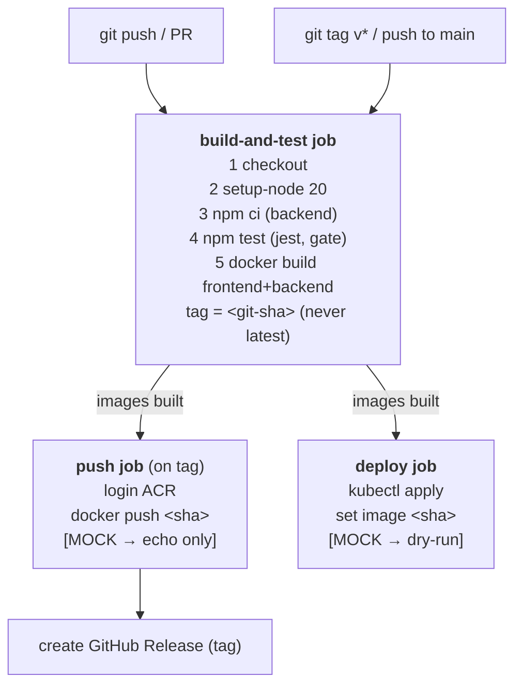
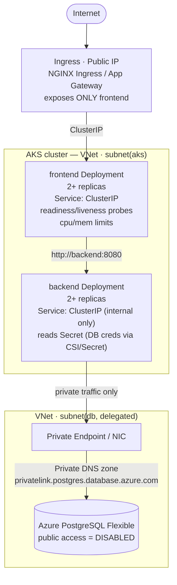

# DevOps Assessment — Build Plan, Guide & Architecture

> Your learning-oriented roadmap for the LogicMatrix DevOps assessment.
> Read top-to-bottom once, then use it as a checklist while you build.

---

## 1. What we are building & why

The assessment asks for a **production-style platform**: two apps → Docker → Docker Compose →
CI/CD → Kubernetes → private database → Terraform → documentation. The graders care far more about
**design, automation, security, troubleshooting, and explanation** than about whether the app is
fancy. So every artifact here is small, correct, and *explained*.

**Confirmed decisions:**

| Area        | Choice                                                                 |
|-------------|------------------------------------------------------------------------|
| Cloud       | **Azure AKS** (ACR, Azure PostgreSQL Flexible Server, Private Endpoint, Log Analytics) |
| App stack   | **Node.js** backend (Express) + **static HTML/JS** frontend (Nginx)    |
| Cloud spend | **Mock / plan-only** — runs locally (Docker Compose + `kind`); Terraform is `validate`/`plan`-clean but never applied; CI mocks push/deploy. Task.md explicitly allows mocking. |
| CI/CD       | **GitHub Actions** (`.github/workflows/deploy.yml`)                     |

**Guiding principles (the "engineering standard" lens):**

1. Every artifact must be explainable — each folder gets a README / doc section.
2. Secrets never touch git — only `*-secret-example.yaml` placeholders are committed.
3. No `latest` image tags — images are tagged with the git SHA.
4. Reproducible locally — a reviewer with no Azure account can still run and grade everything.
5. Small, honest commits — conventional-commit messages, one logical unit each.

---

## 2. Repository structure

```
devops-assessment/
├── frontend/            # static HTML/JS + Nginx (multi-stage Dockerfile, non-root)
├── backend/             # Express API on :8080 + jest tests
├── docker-compose.yml   # frontend + backend + postgres (local only)
├── .dockerignore  .gitignore  .env.example
├── .github/workflows/deploy.yml   # CI/CD pipeline
├── k8s/                 # Kubernetes manifests (2 replicas, probes, limits, ingress...)
├── terraform/           # custom modules: network, aks, acr, database, monitoring
├── docs/                # architecture, cicd, database-connectivity, troubleshooting, future-improvements
├── plan.md              # this file
└── README.md            # top-level overview + quickstart
```

---

## 3. Architecture diagrams

### 3.1 Local development (Docker Compose) — what a reviewer runs


```
  curl localhost:8080         →  Application is running
  curl localhost:8080/health  →  {"status":"ok"}
  postgres has NO published host port  →  mirrors a "private" database
```

### 3.2 CI/CD flow (GitHub Actions)



```
  GitHub Secrets:  ACR_LOGIN_SERVER · ACR_USERNAME · ACR_PASSWORD
                   AZURE_CREDENTIALS · KUBE_CONFIG        (see docs/cicd.md)
```

### 3.3 Azure target architecture (Terraform provisions this; not applied)



```
  Supporting services (Terraform modules):
   • ACR            — AcrPull role granted to the AKS kubelet managed identity (no passwords)
   • Log Analytics  — AKS diagnostic settings stream logs/metrics here
   • NSG on db subnet — allow 5432 inbound from aks subnet only; deny all else
```

---

## 4. Build order (each phase = one commit, always runnable)

| Phase | Task | Deliverables | Checkpoint |
|-------|------|--------------|-----------|
| **A** ✅ | 1 | backend, frontend, Dockerfiles, docker-compose, .dockerignore, .env.example | `docker compose up -d` → both curl commands pass (**done & verified**) |
| **B** | 2 | `.github/workflows/deploy.yml`, `docs/cicd.md` | Pipeline green: tests + build; mock push/deploy log clearly |
| **C** | 3 | `k8s/*` manifests | `kind` cluster → `kubectl apply` → pods Ready 2/2 |
| **D** | 4 | `docs/database-connectivity.md` | Explains private endpoint, DNS, NSG, verification |
| **E** | 5 | `terraform/` custom modules + README | `terraform validate` + `fmt -check` pass |
| **F** | 6,7 | `docs/architecture.md`, `troubleshooting.md`, `future-improvements.md`, top-level `README.md` | Docs complete |
| **G** | — | `git init`, commits, secret-leak check | `git ls-files` shows no state/env/keys |

**Legend:** ✅ = complete.

---

## 5. Key implementation rules (pinned)

- Backend `/` returns **exactly** `Application is running` (plain text); `/health` returns
  **exactly** `{"status":"ok"}`; listens on **8080**. The graders test these literally with curl.
- Frontend calls the backend only through the relative `/api/*` path → the same static bundle
  works in both Compose and Kubernetes; the proxy target is set by infrastructure (env/ConfigMap).
- Image tags = git SHA (and semver on release), injected at deploy time — **never `latest`**.
- Containers run **non-root** (backend: `node` user; frontend: nginx-unprivileged).
- CI mock steps are real commands guarded by a `MOCK` flag with an `echo` fallback — honest about
  what is simulated and trivially flippable to real Azure later.

---

## 6. How we prove it works (all local & free)

| Task | Verification |
|------|--------------|
| 1 | `docker compose up -d` → `curl localhost:8080` = `Application is running`; `/health` = `{"status":"ok"}`; frontend page shows backend status *(verified ✅)* |
| 2 | Push branch → Actions run green; tag → Release; mock steps logged |
| 3 | `kind create cluster` → `kubectl apply` → `kubectl get pods` all Ready 2/2; backend Service is ClusterIP |
| 4 | Doc review + Terraform shows private endpoint & NSG; `nslookup` / `az` verification steps documented |
| 5 | `terraform init -backend=false && terraform validate && terraform fmt -check` pass |
| 6–7 | All 15 troubleshooting questions answered; 6+ improvements with the 5 required sub-points |
| Security | `git ls-files` shows no `.tfstate` / `.env` / keys; only `*-secret-example.yaml` present |

---

## 7. Design choices made for you (flag if you disagree)

- **Ingress:** NGINX Ingress in manifests (portable, works on local `kind`); Terraform notes the
  Azure-native App Gateway Ingress Controller as the production alternative.
- **Database:** Azure PostgreSQL **Flexible Server** with a private endpoint (cleaner than a
  VM-hosted DB, still free-tier friendly).
- **Frontend:** static HTML+JS behind Nginx (no React build) to keep CI fast and Dockerfiles clear
  — the assessment grades DevOps, not front-end frameworks. Easy to swap to React later.
